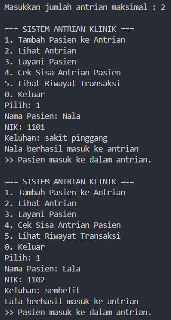

|  |  Algorithm and Data Structure | 
|--|--|
|  Kelompok 5 |
| Anggota |  Helmi Rizqi Ramadhan (244107020107) / 11 |
|         |  Nayla Akas Oktavia (244107020038) / 21 |
|         |  Savero Athallah Hardiana Putra (244107020116) / 25 |
| Kelas | TI - 1H |
| Repository | [link] (https://github.com/Atherizz/case-method-alsd) |
# case-method-alsd
Membuat sistem antrian pasien di klinik dokter.

1. Tambah Pasien ke Antrian

2. Lihat Antrian

3. Layani Pasien

4. Cek Sisa Antrian Pasien

5. Lihat Riwayat Transaksi

